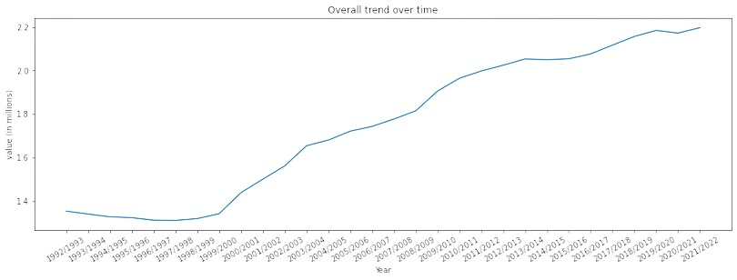

# Postsecondary Enrolments in Canada Analysis

Welcome to the Postsecondary Enrolments in Canada Analysis project! 
This project focuses on analyzing the Postsecondary Student Information System (PSIS) data provided by Statistics Canada. 
PSIS is a national survey that collects detailed information on enrolments and graduates of Canadian public postsecondary institutions.

 
## Project Overview

### Data Source
The dataset used in this analysis is obtained from Statistics Canada's Table 37-10-0015-01 on Postsecondary enrolments. The data includes information on enrolments categorized by credential type, age group, registration status, program type, and gender.

- [Statistics Canada Data Source](https://www150.statcan.gc.ca/t1/tbl1/en/tv.action?pid=3710001501)

### Data Release
The dataset was last updated on November 22, 2023.

### Data Timeline
The data spans from the academic year 1992/1993 to 2021/2022, providing a comprehensive view of postsecondary enrolments in Canada over several decades.

## Key Features

- **Credential Type:** Analysis based on different types of credentials, such as certificates, diplomas, and degrees.
- **Age Group:** Examination of enrolments across various age groups.
- **Registration Status:** Insights into full-time and part-time enrolment trends.
- **Program Type:** Understanding enrolments in different program types.
- **Gender:** Analysis of enrolments based on gender.

## Key Findings

1. **Enrolment Trends:**
   - From the year 1992/1993 to 1998/1999, there was a downward trend in admissions. However, after that period, there was a sudden rise in admissions, and it has been increasing ever since.
    
   
2. **Gender Disparity:**
   - Women's admissions have consistently been higher compared to men over the years.
     

3. **Program Type Analysis:**
   - Admissions in the "Business, Management, and Public Administration" program type have been on a consistent rise since 2007/2008.
     

4. **Regional Analysis - British Columbia:**
   - University admissions in British Columbia saw a sudden rise in 2008/2009 but have shown a slight decline in the last 3-4 years.
   - College admissions in British Columbia nearly doubled between 1999/2000 and 2001/2002 but experienced a significant fall in 2008/2009. Since then, university admissions have consistently surpassed college admissions.
     

## Project Structure

- **Notebook-Final.ipynb**: Jupyter Notebook containing the data analysis, visualizations, and key insights.
